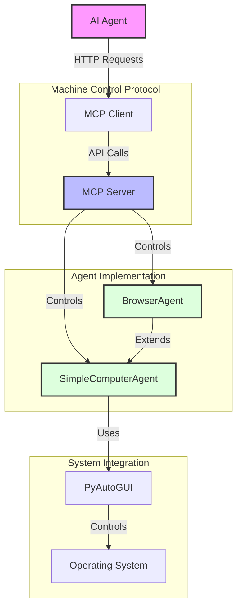
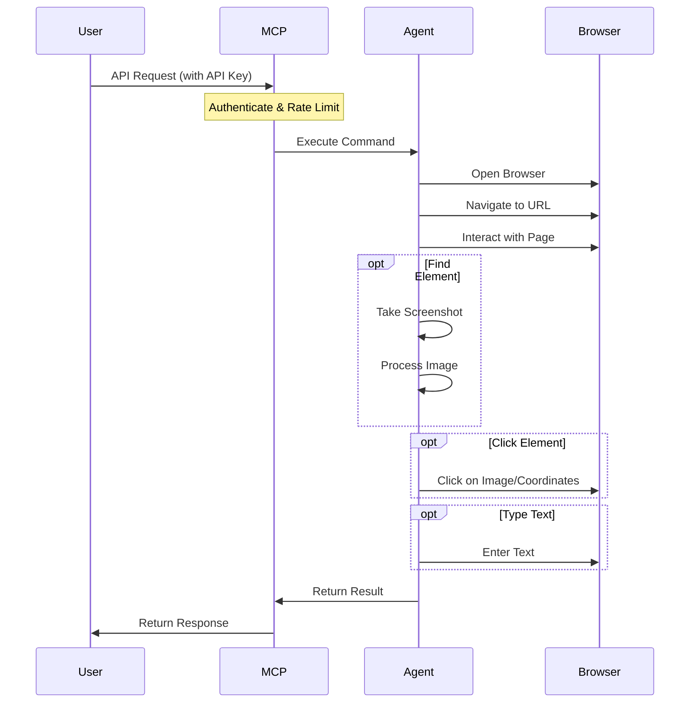
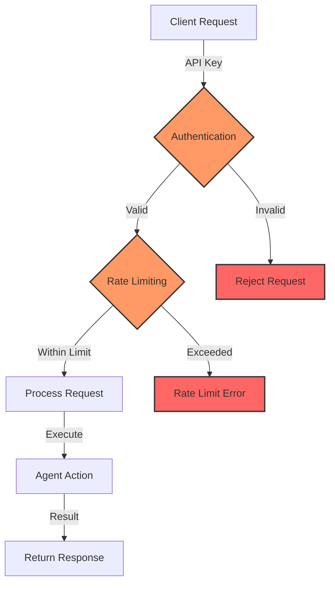

# Simple Computer Control Agent MVP

A minimal implementation of an agent that can control a computer through basic operations like moving the cursor, clicking, and taking screenshots.

## Core Features

The simplest implementation focuses on:
1. Mouse movement and clicking
2. Taking screenshots
3. Basic command execution
4. Text typing

## Installation

1. Install the required dependencies:
   ```
   pip install -r requirements.txt
   ```
2. (Optional) Create and configure your environment variables:
   ```
   cp .env.example .env
   # Edit .env file with your preferred settings
   ```

## How to Use

### Command Line Interface

Run the interactive command-line interface:

```
python main.py
```

Enter commands like:
- `move 500 300` (moves cursor to x=500, y=300)
- `click` (performs a click)
- `doubleclick` (performs a double-click)
- `screenshot` (captures the screen)
- `type Hello world` (types the text)
- `exit` (quits the program)

### Programmatic Usage

You can also use the agent programmatically in your own scripts:

```python
from agent import SimpleComputerAgent

agent = SimpleComputerAgent()

# Move mouse to coordinates
agent.move(500, 300)

# Click
agent.click()

# Type text
agent.type_text("Hello, world!")

# Take a screenshot
screenshot_path = agent.take_screenshot()
```

See the `examples/basic_usage.py` file for a simple example.

## Project Structure

```
computer_use_AI/
├── agent.py               # Basic computer control agent
├── browser_agent.py       # Extended agent with browser capabilities
├── mcp_server.py          # Full MCP server implementation
├── simple_mcp_server.py   # Minimal MCP server for testing
├── mcp_client.py          # Client library for MCP server
├── mcp_protocol.md        # MCP protocol specification
├── main.py                # Command-line interface
├── requirements.txt       # Dependencies
├── README.md              # This documentation
├── .env.example           # Template for environment variables
├── Dockerfile             # Docker configuration
├── docker-compose.yml     # Docker Compose configuration
├── cloud-run-config.yaml  # GCP Cloud Run configuration
├── gcp-deployment-guide.md # Guide for GCP deployment
├── test_mcp.py            # Test script for MCP functionality
└── examples/              # Example scripts
    ├── basic_usage.py     # Example of basic agent usage
    ├── browser_workflow.py # Example of browser navigation
    └── mcp_client_example.py # Example of MCP client usage
```

## Workflow Visualization

The following diagram illustrates the architecture of the Computer Control Agent:



## Browser Workflow Example

The following diagram illustrates how the browser workflow operates:



## Security Architecture



## Creating Custom Workflows

You can create custom workflows by defining a sequence of actions:

```python
from browser_agent import BrowserAgent

# Initialize the agent
agent = BrowserAgent()

# Save a reference image of a button or link
button_image = agent.save_reference_image("login_button")

# Create a workflow
workflow = agent.create_workflow("Login Workflow", [
    ("open_browser", "chrome"),
    ("navigate_to_url", "https://example.com"),
    ("wait", 2),
    ("click_on_image", button_image),
    ("wait", 1),
    ("type", "username"),
    ("press", "tab"),
    ("type", "password"),
    ("press", "enter")
])

# Run the workflow
workflow()
```

## Extension Ideas

This MVP could be extended with:
- Image recognition to find and click on UI elements
- Simple decision-making based on screenshots
- Reading text from screen (OCR)
- Recording sequences of actions for replay
- Custom command scripting

## Dependencies

- PyAutoGUI: For controlling mouse and keyboard
- Pillow: For handling screenshots

## Limitations

- The agent has no awareness of what's on screen - it blindly follows commands
- No error recovery if actions fail
- Limited to basic mouse/keyboard operations
- No complex decision making

## Security Features

The Computer Control Agent includes several security features to ensure safe operation:

1. **API Key Authentication**: All MCP server endpoints are protected with API key authentication
2. **Rate Limiting**: Prevents abuse by limiting requests (default: 60 requests per minute)
3. **Local Binding**: By default, the server binds only to localhost (127.0.0.1)
4. **Environment Variables**: Sensitive configuration is managed through environment variables
5. **Error Handling**: Comprehensive error handling to prevent crashes and unexpected behavior

### Environment Variables

The following environment variables can be configured:

| Variable | Description | Default |
|----------|-------------|---------|
| `MCP_API_KEY` | API key for authenticating requests | *Required* |
| `MCP_RATE_LIMIT` | Maximum requests per minute | 60 |
| `MCP_BIND_HOST` | Host to bind the server to | 127.0.0.1 |
| `MCP_PORT` | Port to run the server on | 5000 |
| `MCP_DEBUG` | Enable debug mode | False |

### Docker Security

When running in Docker, the following security measures are in place:

1. Container ports are only exposed to localhost by default
2. Environment variables are passed securely to the container
3. Health checks ensure the service is operating correctly
4. Container restart policy ensures reliability

## MCP Server API

The Machine Control Protocol (MCP) server provides a REST API for controlling the computer:

### Authentication

All API endpoints require an API key to be provided in the `X-API-Key` header:

```
X-API-Key: your_api_key_here
```

### Endpoints

| Endpoint | Method | Description |
|----------|--------|-------------|
| `/api/v1/status` | GET | Check server status |
| `/api/v1/screenshot` | GET | Take a screenshot |
| `/api/v1/mouse/move` | POST | Move mouse to coordinates |
| `/api/v1/mouse/click` | POST | Click at current position |
| `/api/v1/keyboard/type` | POST | Type text |
| `/api/v1/keyboard/press` | POST | Press a key |

### Example API Request

```python
import requests

# API configuration
api_url = "http://localhost:5000/api/v1"
headers = {"X-API-Key": "your_api_key_here"}

# Take a screenshot
response = requests.get(f"{api_url}/screenshot", headers=headers)
if response.status_code == 200:
    with open("screenshot.png", "wb") as f:
        f.write(response.content)
```

## Error Handling

The Computer Control Agent includes comprehensive error handling:

1. **Input Validation**: All inputs are validated before processing
2. **Logging**: Detailed logging of operations and errors
3. **Graceful Failure**: Operations fail gracefully with meaningful error messages
4. **Boundary Checking**: Mouse coordinates are validated against screen boundaries
5. **Exception Handling**: All operations are wrapped in try-except blocks

## macOS Permissions

On macOS, you'll need to grant specific permissions for the agent to work properly:

1. **Accessibility Permissions**: The agent needs permission to control your computer.
   - Go to System Preferences > Security & Privacy > Privacy > Accessibility
   - Add your terminal application or Python interpreter to the list of allowed apps

2. **Screen Recording Permissions**: Required for the screenshot functionality.
   - Go to System Preferences > Security & Privacy > Privacy > Screen Recording
   - Add your terminal application or Python interpreter to the list of allowed apps

You'll typically be prompted for these permissions the first time you run the agent. If you encounter permission errors, make sure these settings are configured correctly.

## Docker Deployment

This project can be run in a Docker container, which is especially useful for cloud deployment or headless environments.

### Building and Running with Docker

```bash
# Build the Docker image
docker-compose build

# Run the container
docker-compose up
```

The Docker setup includes:
- A virtual display using Xvfb
- VNC server for remote viewing (accessible on port 5900)
- Firefox browser pre-installed

You can connect to the running container using any VNC client at `localhost:5900`.

### Docker Configuration Files

- `Dockerfile`: Contains the configuration for building the Docker image
- `docker-compose.yml`: Simplifies the process of running the container
- `.dockerignore`: Specifies files that should not be included in the Docker image

## Google Cloud Platform Deployment

This project can be deployed to Google Cloud Platform (GCP) using Cloud Run.

### Deployment Steps

See the detailed instructions in `gcp-deployment-guide.md` for:
- Setting up your GCP project
- Building and pushing the Docker image
- Deploying to Cloud Run
- Accessing your deployed agent

### GCP Configuration Files

- `cloud-run-config.yaml`: Configuration for deploying to GCP Cloud Run

## Cloud Deployment and MCP

### Understanding MCP and Cloud Deployment

The Machine Control Protocol (MCP) is a standardized interface for controlling a computer. It can be deployed in different environments:

1. **Local Deployment**: Run the MCP server on your local machine for direct control
2. **Cloud Deployment**: Run the MCP server in a cloud environment for remote control

### When to Use Cloud Deployment (GCP/AWS)

Cloud deployment of the MCP server is useful when:

1. **Remote Access**: You need to control a computer from anywhere
2. **Scalability**: You need to run multiple instances of the agent
3. **Integration**: You want to integrate with other cloud services
4. **Availability**: You need high availability and reliability

### Efficient Cloud Instance Configuration

When deploying to GCP or AWS:

1. **Right-size your instance**: Choose an instance type that matches your workload
   - For basic automation: e2-medium (2 vCPU, 4GB memory)
   - For browser automation: e2-standard-4 (4 vCPU, 16GB memory)

2. **Use spot/preemptible instances** for non-critical workloads to reduce costs

3. **Configure auto-scaling** based on usage patterns

4. **Use regional deployments** closest to your users for lower latency

5. **Enable monitoring and logging** for performance optimization

### Is Cloud Deployment Necessary?

Cloud deployment is **not necessary** if:

1. You only need to control the local computer
2. You don't need remote access to the agent
3. You have limited automation needs

In these cases, running the MCP server locally is sufficient and more cost-effective.
