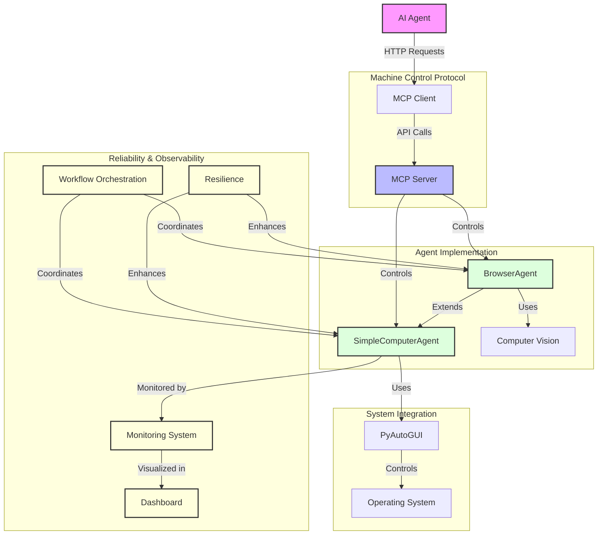
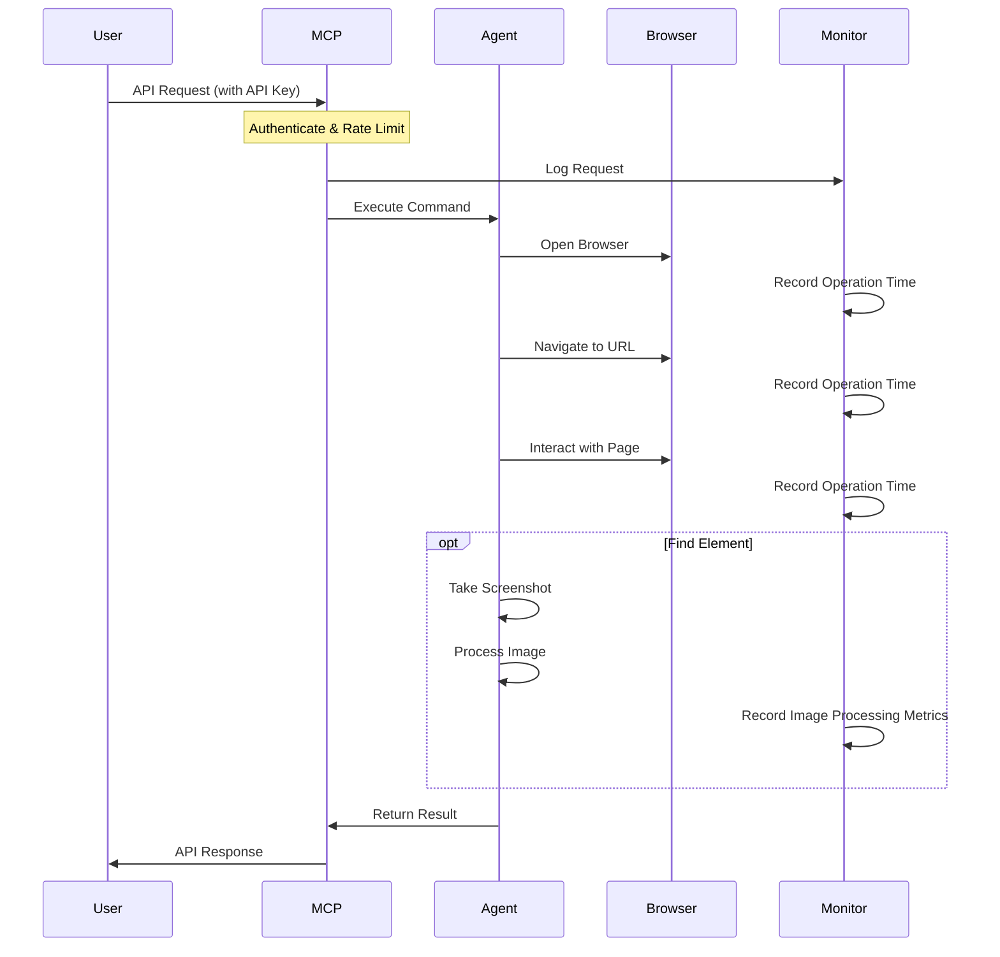

# Computer Control Agent

A comprehensive system that enables AI agents to control computer systems through basic operations like moving the cursor, clicking, taking screenshots, and browser automation.

## Core Features

This implementation includes:
1. Mouse movement and clicking
2. Taking screenshots
3. Text typing and keyboard control
4. Browser automation
5. Computer vision for visual element detection
6. Machine Control Protocol (MCP) for remote control
7. Monitoring and observability
8. Workflow orchestration
9. Error recovery and resilience

## Recent Updates

- Fixed MCP server implementation to include all required endpoints (mouse/click, keyboard/type)
- Improved error handling in MCP client for rate limiting and HTTP errors
- Enhanced integration tests for better reliability

## Installation

1. Install the required dependencies:
   ```
   pip install -r requirements.txt
   ```
2. (Optional) Create and configure your environment variables:
   ```
   cp config/.env.example .env
   # Edit .env file with your preferred settings
   ```

## How to Use

### Command Line Interface

Run the interactive command-line interface:

```
python main.py
```

Enter commands like:
- `move 500 300` (moves cursor to x=500, y=300)
- `click` (performs a click)
- `doubleclick` (performs a double-click)
- `screenshot` (captures the screen)
- `type Hello world` (types the text)
- `exit` (quits the program)

### Programmatic Usage

You can also use the agent programmatically in your own scripts:

```python
import sys
import os
sys.path.append(os.path.dirname(os.path.abspath(__file__)))
from src.core.agent import SimpleComputerAgent

agent = SimpleComputerAgent()

# Move mouse to coordinates
agent.move(500, 300)

# Click
agent.click()

# Type text
agent.type_text("Hello, world!")

# Take a screenshot
screenshot_path = agent.take_screenshot()
```

See the `examples/basic_usage.py` file for a simple example.

### Machine Control Protocol (MCP)

To enable remote control of the computer by AI agents, start the MCP server:

```
python src/api/mcp_server.py
```

Then AI agents can connect to the MCP server using the MCP client:

```python
from src.api.mcp_client import MCPClient

client = MCPClient(
    base_url="http://localhost:5000/api/v1",
    api_key="your_api_key"  # Set in .env file
)

# Move mouse
client.move_mouse(500, 300)

# Click
client.click()

# Type text
client.type_text("Hello from AI!")
```

See the `examples/mcp_client_example.py` file for a complete example.

## Project Structure

```
computer_use_AI/
├── src/                  # Source code
│   ├── core/             # Core agent functionality
│   │   ├── __init__.py   # Package initialization
│   │   ├── agent.py      # Basic computer control agent
│   │   ├── browser_agent.py # Extended agent with browser capabilities
│   │   └── computer_vision.py # Computer vision utilities for image recognition
│   ├── api/              # API and protocol implementation
│   │   ├── __init__.py   # Package initialization
│   │   ├── mcp_server.py # Full MCP server implementation
│   │   ├── simple_mcp_server.py # Minimal MCP server for testing
│   │   └── mcp_client.py # Client library for MCP server
│   ├── monitoring/       # Monitoring and observability
│   │   ├── __init__.py   # Package initialization
│   │   ├── monitoring.py # Monitoring and observability system
│   │   └── dashboard.py  # Web-based dashboard for monitoring and visualization
│   ├── utils/            # Utility functions
│   │   ├── __init__.py   # Package initialization
│   │   └── resilience.py # Error recovery and resilience features
│   └── workflows/        # Workflow orchestration
│       ├── __init__.py   # Package initialization
│       └── workflow.py   # Workflow orchestration and scripting
├── config/               # Configuration files
│   ├── .env.example      # Template for environment variables
│   └── cloud-run-config.yaml # GCP Cloud Run configuration
├── main.py               # Command-line interface
├── run_tests.py          # Test runner for all unit and integration tests
├── requirements.txt      # Dependencies
├── README.md             # This documentation
├── mcp_protocol.md       # MCP protocol specification
├── gcp-deployment-guide.md # Guide for GCP deployment
├── Dockerfile            # Docker configuration
├── docker-compose.yml    # Docker Compose configuration
├── logs/                 # Directory for log files
│   └── activity.log      # Activity log file
├── metrics/              # Directory for metrics data
├── tests/                # Test directory
│   ├── __init__.py       # Package initialization
│   ├── test_agent.py     # Tests for agent functionality
│   ├── test_mcp_integration.py # Integration tests for MCP
│   ├── test_monitoring.py # Tests for monitoring system
│   └── test_workflow_integration.py # Tests for workflow integration
└── examples/             # Example scripts
    ├── basic_usage.py    # Example of basic agent usage
    ├── browser_workflow.py # Example of browser navigation
    └── mcp_client_example.py # Example of MCP client usage
```

## Architecture Visualization

The following diagram illustrates the architecture of the Computer Control Agent:



## Browser Workflow Example

The following diagram illustrates how the browser workflow operates:



## Security Features

The Machine Control Protocol (MCP) includes several security features:

1. **API Key Authentication**: All endpoints require a valid API key
2. **Rate Limiting**: Prevents abuse (default: 60 requests/minute)
3. **Local Binding**: Server binds to localhost by default (127.0.0.1)
4. **Environment Configuration**: Security settings can be configured via environment variables
5. **Error Handling**: Improved error handling and connection reliability

## Workflow Example

Here's an example of creating and running a workflow:

```python
from src.core.browser_agent import BrowserAgent
from src.workflows.workflow import create_workflow

agent = BrowserAgent()

# Define a login workflow
login_workflow = create_workflow("Login Workflow", [
    ("open_browser", "chrome"),
    ("navigate_to_url", "https://example.com/login"),
    ("type_text", "username"),
    ("press_key", "tab"),
    ("type_text", "password"),
    ("press_key", "enter"),
    ("wait", 3)  # Wait for login to complete
])

# Execute the workflow
result = login_workflow.execute()
if result.success:
    print("Login successful!")
else:
    print(f"Login failed: {result.error}")
```

## Docker Support

The Computer Control Agent can be run in a Docker container with GUI automation support.

### Building the Docker Image

```
docker build -t computer-control-agent .
```

### Running with Docker Compose

```
docker-compose up
```

You can connect to the running container using any VNC client at `localhost:5900`.

### Docker Configuration Files

- `Dockerfile`: Contains the configuration for building the Docker image
- `docker-compose.yml`: Contains the configuration for running the container

## GCP Deployment

For deploying to Google Cloud Platform, see the `gcp-deployment-guide.md` file.

## Contributing

Contributions are welcome! Please feel free to submit a Pull Request.

## License

This project is licensed under the MIT License - see the LICENSE file for details.
