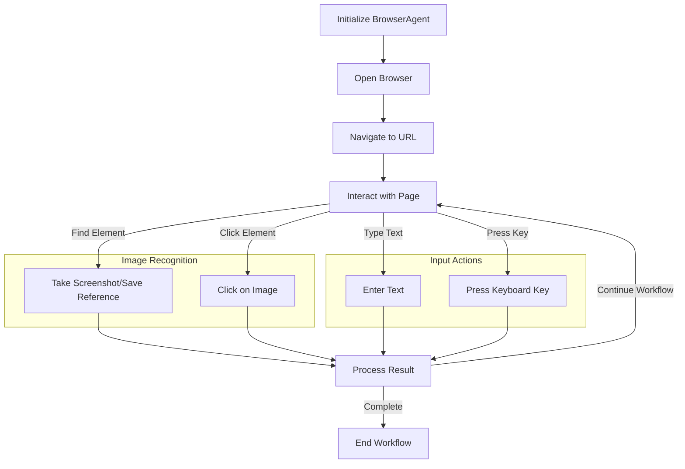
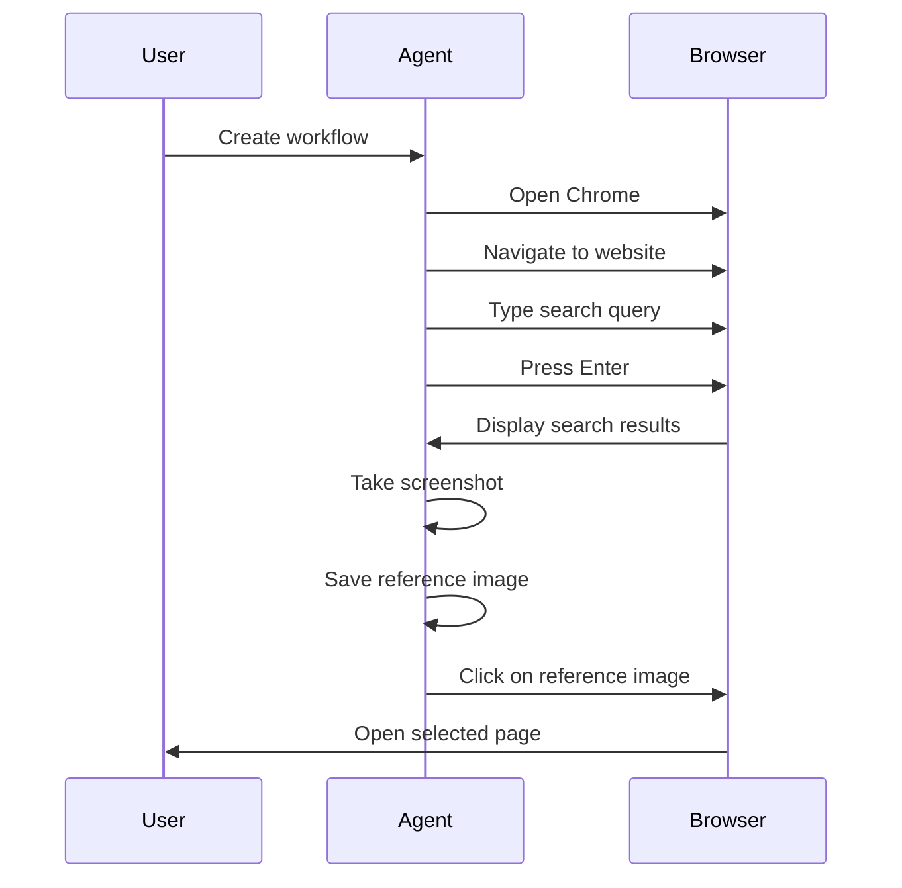

# Simple Computer Control Agent MVP

A minimal implementation of an agent that can control a computer through basic operations like moving the cursor, clicking, and taking screenshots.

## Core Features

The simplest implementation focuses on:
1. Mouse movement and clicking
2. Taking screenshots
3. Basic command execution
4. Text typing

## Installation

1. Install the required dependencies:
   ```
   pip install -r requirements.txt
   ```
2. (Optional) Create and configure your environment variables:
   ```
   cp .env.example .env
   # Edit .env file with your preferred settings
   ```

## How to Use

### Command Line Interface

Run the interactive command-line interface:

```
python main.py
```

Enter commands like:
- `move 500 300` (moves cursor to x=500, y=300)
- `click` (performs a click)
- `doubleclick` (performs a double-click)
- `screenshot` (captures the screen)
- `type Hello world` (types the text)
- `exit` (quits the program)

### Programmatic Usage

You can also use the agent programmatically in your own scripts:

```python
from agent import SimpleComputerAgent

agent = SimpleComputerAgent()

# Move mouse to coordinates
agent.move(500, 300)

# Click
agent.click()

# Type text
agent.type_text("Hello, world!")

# Take a screenshot
screenshot_path = agent.take_screenshot()
```

See the `examples/basic_usage.py` file for a simple example.

## Project Structure

```
computer_use_AI/
├── agent.py               # Basic computer control agent
├── browser_agent.py       # Extended agent with browser capabilities
├── requirements.txt       # Dependencies
├── README.md              # This documentation
├── main.py                # Command-line interface for basic agent
├── .env.example           # Template for environment variables
├── .gitignore             # Git ignore rules
├── .dockerignore          # Docker ignore rules
├── Dockerfile             # Docker configuration
├── docker-compose.yml     # Docker Compose configuration
├── cloud-run-config.yaml  # GCP Cloud Run configuration
├── gcp-deployment-guide.md # Guide for GCP deployment
├── screenshots/           # Directory for storing screenshots (created at runtime)
├── reference_images/      # Directory for storing reference images (created at runtime)
└── examples/
    ├── basic_usage.py     # Example of basic agent usage
    └── browser_workflow.py # Example of browser navigation workflow
```

## Workflow Visualization

The following diagram illustrates how the browser workflow operates:



## Browser Workflow Example

Here's an example of a workflow that opens a browser, navigates to a website, and interacts with it:



## Creating Custom Workflows

You can create custom workflows by defining a sequence of actions:

```python
from browser_agent import BrowserAgent

# Initialize the agent
agent = BrowserAgent()

# Save a reference image of a button or link
button_image = agent.save_reference_image("login_button")

# Create a workflow
workflow = agent.create_workflow("Login Workflow", [
    ("open_browser", "chrome"),
    ("navigate_to_url", "https://example.com"),
    ("wait", 2),
    ("click_on_image", button_image),
    ("wait", 1),
    ("type", "username"),
    ("press", "tab"),
    ("type", "password"),
    ("press", "enter")
])

# Run the workflow
workflow()
```

## Extension Ideas

This MVP could be extended with:
- Image recognition to find and click on UI elements
- Simple decision-making based on screenshots
- Reading text from screen (OCR)
- Recording sequences of actions for replay
- Custom command scripting

## Dependencies

- PyAutoGUI: For controlling mouse and keyboard
- Pillow: For handling screenshots

## Limitations

- The agent has no awareness of what's on screen - it blindly follows commands
- No error recovery if actions fail
- Limited to basic mouse/keyboard operations
- No complex decision making

## macOS Permissions

On macOS, you'll need to grant specific permissions for the agent to work properly:

1. **Accessibility Permissions**: The agent needs permission to control your computer.
   - Go to System Preferences > Security & Privacy > Privacy > Accessibility
   - Add your terminal application or Python interpreter to the list of allowed apps

2. **Screen Recording Permissions**: Required for the screenshot functionality.
   - Go to System Preferences > Security & Privacy > Privacy > Screen Recording
   - Add your terminal application or Python interpreter to the list of allowed apps

You'll typically be prompted for these permissions the first time you run the agent. If you encounter permission errors, make sure these settings are configured correctly.

## Docker Deployment

This project can be run in a Docker container, which is especially useful for cloud deployment or headless environments.

### Building and Running with Docker

```bash
# Build the Docker image
docker-compose build

# Run the container
docker-compose up
```

The Docker setup includes:
- A virtual display using Xvfb
- VNC server for remote viewing (accessible on port 5900)
- Firefox browser pre-installed

You can connect to the running container using any VNC client at `localhost:5900`.

### Docker Configuration Files

- `Dockerfile`: Contains the configuration for building the Docker image
- `docker-compose.yml`: Simplifies the process of running the container
- `.dockerignore`: Specifies files that should not be included in the Docker image

## Google Cloud Platform Deployment

This project can be deployed to Google Cloud Platform (GCP) using Cloud Run.

### Deployment Steps

See the detailed instructions in `gcp-deployment-guide.md` for:
- Setting up your GCP project
- Building and pushing the Docker image
- Deploying to Cloud Run
- Accessing your deployed agent

### GCP Configuration Files

- `cloud-run-config.yaml`: Configuration for deploying to GCP Cloud Run
